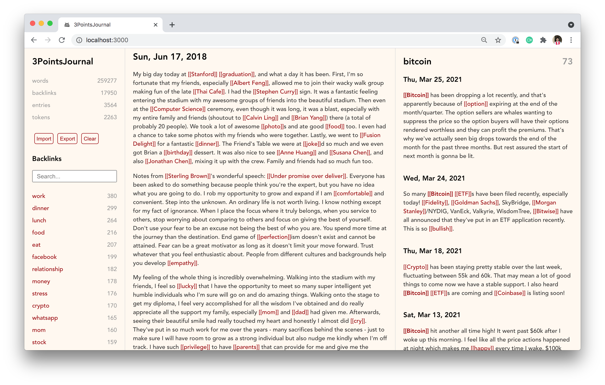

# 3PointsJournal

## Introduction

I've been journaling every day since I graduated college and started working full time.

Before I go to bed, I write down 3 things, whatever it's on my mind.

When I saw Roam, I thought it would be a good idea to create a network of thoughts from my own journal entries.

The result is this little React app, 3PointsJournal.

## How to use it

Every day, you write down 3 things.

You can use 2 brackets (like `[[concept]]`) to tokenize any ideas in your journal.

In the left column, you can see your writing stats and a list of tokens.

In the middle column, you can write and tokenize. There are two modes - read and write. Use the `escape` key to switch between them.

In the right column, you can see a list of entries for the selected token.

## Look and Feel

